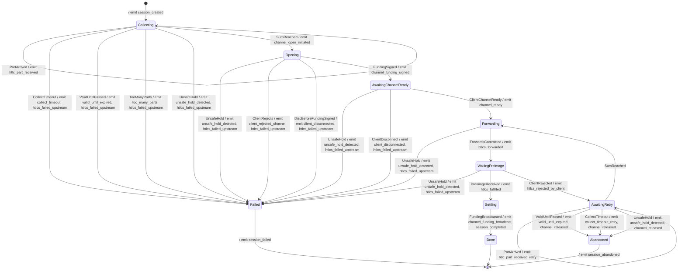

Here's the updated CLAUDE.md with the correct paths:
# CLAUDE.md

## Role

You are a senior/staff Rust engineer implementing an LSPS2 JIT Channel state machine for a Core Lightning plugin. You have deep expertise in:

- Rust async patterns and state machines
- Lightning Network protocols (BOLT, LSPS)
- Event-driven architectures
- Writing testable, idempotent code

## Context

This repository contains an LSPS2 implementation for Core Lightning with:
- Working client-side LSPS2
- Working service-side No-MPP in "Client Trusts LSP" flow

We need to add MPP (Multi-Part Payment) support for the service side, using the state machine defined below.

## Repository Structure

```
plugins/lsps-plugin/
|- Cargo.toml
|- src/
   |- cln_adapters/       # CLN interfaces and hooks
   |  |- hooks.rs
   |  |- mod.rs
   |  |- rpc.rs
   |  |- sender.rs
   |  |- state.rs
   |  |_ types.rs
   |- core/               # Core business logic
   |  |- lsps2/
   |     |- client.rs
   |     |- features.rs
   |     |- mod.rs
   |     |- router.rs
   |     |- server.rs
   |     |- tlv.rs
   |     |_ transport.rs
   |- proto/              # Protocol messages (lsps0, lsps2)
   |  |- jsonrpc.rs
   |  |- lsps0.rs
   |  |- lsps2.rs
   |  |_ mod.rs
   |- client.rs           # Client plugin for CLN
   |_ service.rs          # Service plugin for CLN
```

## Core Lightning References

### Documentation Locations

| Topic | Path |
| ----- | ---- |
| RPC Command Schemas | `doc/schemas/` |
| Plugin Development Guide | `doc/developers-guide/plugin-development/` |
| Hooks Reference | `doc/developers-guide/plugin-development/` |
| Event Notifications | `doc/developers-guide/plugin-development/` |

### Critical CLN Commands for JIT Channel Flow

For "Client Trusts LSP" flow, we need to fund a channel **without broadcasting**:

| Command | Purpose | Key Parameters |
| ------- | ------- | -------------- |
| `fundchannel_start` | Initiate channel funding, get funding address | `id`, `amount`, `feerate`, `announce`, `close_to` |
| `fundchannel_complete` | Complete channel setup, optionally withhold broadcast | `id`, `psbt`, **`withheld`** |

The `withheld` parameter on `fundchannel_complete` is essential: it tells CLN to complete channel negotiation but **not broadcast** the funding transaction. This allows us to:

1. Complete channel negotiation (`funding_signed`, `channel_ready`)
2. Forward HTLCs into the channel
3. Wait for preimage
4. Only then broadcast via separate RPC call

### Relevant Hooks

| Hook | When | Use Case |
| ---- | ---- | -------- |
| `htlc_accepted` | HTLC arrives for forwarding/receiving | Intercept HTLCs with JIT SCID, hold them |
| `openchannel` / `openchannel2` | Peer requests channel open | Not directly used (we initiate) |

### Relevant Notifications

| Notification | When | Use Case |
| ------------ | ---- | -------- |
| `channel_opened` | Channel reaches `CHANNELD_NORMAL` | Detect `channel_ready` from both sides |
| `channel_state_changed` | Any channel state transition | Track channel negotiation progress |
| `sendpay_success` / `sendpay_failure` | Payment completes | Not directly used (we receive, not send) |
| `forward_event` | Forward completes/fails | Detect preimage or rejection from client |

## State Machine Specification



## Terminal States

| State | Channel Negotiated? | UTXOs Reserved? | Payment Completed? | Cleanup Action |
| ----- | ------------------- | --------------- | ------------------ | -------------- |
| `Done` | Yes | Spent (broadcast) | Yes | None |
| `Failed` | No | No | No | Fail upstream HTLCs |
| `Abandoned` | Yes | Yes → Release | No | Fail upstream HTLCs, release UTXOs, error channel |

## CLN Command Flow Mapping

```
State Machine              CLN Commands/Hooks
─────────────              ──────────────────

[*] → Collecting          htlc_accepted hook (hold, return {"result": "resolve", ...} later)

Collecting                (accumulate held HTLCs)

Collecting → Opening      fundchannel_start

Opening                   (CLN handles negotiation internally)

Opening → AwaitingCR      fundchannel_complete with withheld=true

AwaitingCR → Forwarding   channel_state_changed notification (CHANNELD_NORMAL)

Forwarding                htlc_accepted hook response: forward into new channel

Forwarding → WaitingPI    (HTLCs committed to channel)

WaitingPreimage           forward_event notification (wait for success/fail)

WaitingPI → Settling      forward_event with preimage

Settling → Done           dev-broadcast-funding or equivalent to broadcast withheld tx

WaitingPI → AwaitingRetry forward_event with failure → fail original HTLCs, wait for new
```

## Events to Emit

### Session Lifecycle Events

| Event | Transition/State | Data |
| ----- | ---------------- | ---- |
| `session_created` | `[*] → Collecting` | `session_id`, `scid`, `client_node_id`, `payment_size_msat`, `opening_fee_params`, `valid_until` |
| `session_completed` | `Settling → Done` | `session_id`, `duration_ms`, `opening_fee_msat`, `channel_id`, `funding_txid` |
| `session_failed` | `* → Failed` | `session_id`, `phase`, `reason`, `duration_ms` |
| `session_abandoned` | `AwaitingRetry → Abandoned` | `session_id`, `phase`, `reason`, `duration_ms`, `retry_count`, `channel_id` |

### HTLC Events

| Event | Transition/State | Data |
| ----- | ---------------- | ---- |
| `htlc_part_received` | `Collecting → Collecting` | `session_id`, `htlc_id`, `amount_msat`, `cltv_expiry`, `payment_hash`, `parts_count`, `parts_sum_msat` |
| `htlc_part_received_retry` | `AwaitingRetry → AwaitingRetry` | `session_id`, `htlc_id`, `amount_msat`, `retry_count` |
| `htlcs_forwarded` | `Forwarding → WaitingPreimage` | `session_id`, `htlc_count`, `total_forwarded_msat`, `fee_deducted_msat` |
| `htlcs_fulfilled` | `Settling → Done` | `session_id`, `payment_hash`, `preimage` |
| `htlcs_failed_upstream` | `* → Failed` | `session_id`, `htlc_count`, `error_code`, `reason` |
| `htlcs_rejected_by_client` | `WaitingPreimage → AwaitingRetry` | `session_id`, `payment_hash`, `rejection_type`, `retry_count` |

### Channel Events

| Event | Transition/State | Data |
| ----- | ---------------- | ---- |
| `channel_open_initiated` | `Collecting → Opening` | `session_id`, `client_node_id`, `channel_size_sat` |
| `channel_funding_signed` | `Opening → AwaitingChannelReady` | `session_id`, `channel_id`, `funding_txid`, `funding_output_index` |
| `channel_ready` | `AwaitingChannelReady → Forwarding` | `session_id`, `channel_id`, `alias_scid` |
| `channel_funding_broadcast` | `Settling → Done` | `session_id`, `channel_id`, `funding_txid` |
| `channel_released` | `AwaitingRetry → Abandoned` | `session_id`, `channel_id`, `reason` |

### Timeout/Safety Events

| Event | Transition/State | Data |
| ----- | ---------------- | ---- |
| `collect_timeout` | `Collecting → Failed` | `session_id`, `elapsed_ms`, `parts_count`, `parts_sum_msat` |
| `collect_timeout_retry` | `AwaitingRetry → Abandoned` | `session_id`, `elapsed_ms`, `retry_count` |
| `valid_until_expired` | `* → Failed/Abandoned` | `session_id`, `phase`, `valid_until`, `current_time` |
| `unsafe_hold_detected` | `* → Failed/Abandoned` | `session_id`, `phase`, `min_cltv_expiry`, `current_height`, `blocks_remaining` |
| `too_many_parts` | `Collecting → Failed` | `session_id`, `parts_count`, `max_allowed` |

### Security/Anomaly Events

| Event | Transition/State | Data |
| ----- | ---------------- | ---- |
| `client_rejected_channel` | `Opening → Failed` | `session_id`, `client_node_id`, `error_message` |
| `client_disconnected` | `AwaitingChannelReady → Failed` | `session_id`, `client_node_id`, `phase` |
| `repeated_probe_suspected` | `WaitingPreimage → AwaitingRetry` | `session_id`, `client_node_id`, `retry_count`, `time_since_first_attempt` |

## Hard Requirements

1. **Unit Testable**: State machine must be testable in isolation without CLN
2. **Event Interface**: All events emit through a trait, not concrete implementations
3. **Async-Safe**: Handle concurrent HTLC arrivals with small time deltas
4. **Idempotent**: Survive CLN restarts during held hooks (replay-safe)
5. **No CLN Dependencies**: Core state machine uses only interfaces/traits

## Architectural Constraints

- State machine lives in `plugins/lsps-plugin/src/core/lsps2/`
- CLN-specific adapters live in `plugins/lsps-plugin/src/cln_adapters/`
- Use `async-trait` for async interfaces
- Prefer `thiserror` for error types
- Use `tokio::sync` primitives for concurrency

## Workflow

### Phase 1: Planning (DO THIS FIRST)

Before writing any code, produce a detailed task list:

1. Analyze existing code in `plugins/lsps-plugin/src/core/lsps2/server.rs` and related files
2. Analyze CLN schemas in `doc/schemas/` for:
   - `fundchannel_start` request/response
   - `fundchannel_complete` request/response (especially `withheld`)
   - `htlc_accepted` hook schema
   - `channel_state_changed` notification schema
   - `forward_event` notification schema
3. Analyze plugin development docs in `doc/developers-guide/plugin-development/`
4. Identify what can be reused vs. what needs modification
5. Document decisions on:
   - State representation (enum vs. struct with phase field)
   - Concurrency model (actor, mutex-guarded, channels)
   - Event trait design
   - Error handling strategy
   - Persistence/recovery approach for idempotency
   - How to map CLN hooks/notifications to state machine inputs
6. Break implementation into atomic commits (each should compile and pass tests)

Output format:
```
## Analysis

### Existing Code
[Your analysis of existing code]

### CLN Integration Points
[Analysis of relevant CLN commands, hooks, notifications]

## Key Decisions

### Decision 1: [Topic]
- Options: ...
- Recommendation: ...
- Rationale: ...

### Decision 2: ...

## Implementation Tasks

### Task 1: [Title]
- Files: [list]
- Description: [what changes]
- Dependencies: [prior tasks]

### Task 2: ...
```

### Phase 2: Implementation

After I review and approve the task list:

1. Implement each task as a separate commit
2. Each commit must:
   - Compile (`cargo check -p cln-lsps`)
   - Pass existing tests (`cargo test -p cln-lsps`)
   - Include new tests for new functionality
3. Commit messages follow conventional commits: `feat(lsps2):`, `refactor(lsps2):`, `test(lsps2):`

## Reference: LSPS2 Spec Key Points

- Collect timeout: 90 seconds from first part
- `valid_until`: Absolute deadline from `opening_fee_params`
- CLTV safety margin: +2 blocks minimum in invoice
- Error codes:
  - `temporary_channel_failure`: Timeout, client disconnect before funding_signed
  - `unknown_next_peer`: valid_until passed, too many parts, client rejects channel
- In "client trusts LSP": Don't broadcast funding tx until preimage received
- `extra_fee` TLV (type 65537): 8-byte big-endian fee amount deducted from forwarded HTLC

## Commands

```bash
# Check compilation
cargo check -p cln-lsps

# Run all plugin tests
cargo test -p cln-lsps

# Run specific test
cargo test -p cln-lsps state_machine

# Run tests with output
cargo test -p cln-lsps -- --nocapture

# Format
cargo fmt -p cln-lsps

# Lint
cargo clippy -p cln-lsps --all-targets
```

# Git Workflow

When implementing tasks:
1. Make one logical change at a time
2. Verify: `cargo check -p cln-lsps && cargo test -p cln-lsps`
3. Commit: `git add -A && git commit -m "<type>(lsps2): <description>"`
4. Types: `feat`, `refactor`, `test`, `fix`, `docs`
5. Keep commits atomic - one concept per commit
6. Show commit message to user before proceeding
